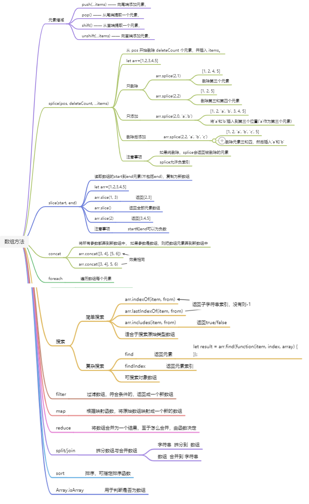

# 说明

仅包含一些**重点**，**容易忽视**的内容，js特殊的知识，方便快速上手js

# 参考资料

[wangdoc](https://wangdoc.com/javascript/)查看一些简单的语法

https://zh.javascript.info/intro 非常好的中文文档

# 1. javascript基础知识

## 1.1 严格模式 "use strict"

长久以来，JavaScript 不断向前发展且并未带来任何兼容性问题。新的特性被加入，旧的功能也没有改变。

这么做有利于兼容旧代码，但缺点是 JavaScript 创造者的任何错误或不完善的决定也将永远被保留在 JavaScript 语言中。

这种情况一直持续到 2009 年 ECMAScript 5 (ES5) 的出现。ES5 规范增加了新的语言特性并且修改了一些已经存在的特性。为了保证旧的功能能够使用，大部分的修改是默认不生效的。你需要一个特殊的指令 —— `"use strict"` 来明确地激活这些特性。

```js
alert("some code");
// 下面的 "use strict" 会被忽略，必须在最顶部。

"use strict";

// 严格模式没有被激活
```


请确保 `"use strict"` 出现在脚本的最顶部，否则严格模式可能无法启用。

现代 JavaScript 支持 “classes” 和 “modules” —— 高级语言结构，它们会自动启用 `use strict`。因此，如果我们使用它们，则无需添加 `"use strict"` 指令。

## 1.2 数据类型

在 JavaScript 中有 8 种基本的数据类型（译注：7 种原始类型和 1 种引用类型）。

### Number 类型

包括整数和浮点数，支持数学常规操作

还包括一些特殊的Number，`Infinity`、`-Infinity` 和 `NaN`。

- `Infinity` 代表数学概念中的 [无穷大](https://en.wikipedia.org/wiki/Infinity) ∞。是一个比任何数字都大的特殊值。
- `NaN` 代表一个计算错误。它是一个不正确的或者一个未定义的数学操作所得到的结果

### BigInt

在 JavaScript 中，“number” 类型无法表示大于 `(253-1)`（即 `9007199254740991`），或小于 `-(253-1)` 的整数。这是其内部表示形式导致的技术限制。

`BigInt` 类型是最近被添加到 JavaScript 语言中的，用于表示任意长度的整数。

可以通过将 `n` 附加到整数字段的末尾来创建 `BigInt` 值。

```js
// 尾部的 "n" 表示这是一个 BigInt 类型
const bigInt = 1234567890123456789012345678901234567890n;
```

### String 类型

JavaScript 中的字符串必须被括在引号里。

```js
let str = "Hello";
let str2 = 'Single quotes are ok too';
let phrase = `can embed another ${str}`;
```

在 JavaScript 中，有三种包含字符串的方式。

1. 双引号：`"Hello"`.
2. 单引号：`'Hello'`.
3. 反引号：``Hello``.

反引号是 **功能扩展** 引号。它们允许我们通过将变量和表达式包装在 `${…}` 中，来将它们嵌入到字符串中。

```js
let name = "John";

// 嵌入一个变量
alert( `Hello, ${name}!` ); // Hello, John!

// 嵌入一个表达式
alert( `the result is ${1 + 2}` ); // the result is 3
```

### Boolean类型（逻辑类型）

`true` or `false`

### "null" 值

特殊的 `null` 值不属于上述任何一种类型。它构成了一个独立的类型，只包含 `null` 值：

相比较于其他编程语言，JavaScript 中的 `null` 不是一个“对不存在的 `object` 的引用”或者 “null 指针”。

JavaScript 中的 `null` 仅仅是一个代表“无”、“空”或“值未知”的特殊值。

### "undefined" 值

特殊值 `undefined` 和 `null` 一样自成类型。

`undefined` 的含义是 `未被赋值`。

如果一个变量已被声明，但未被赋值，那么它的值就是 `undefined`：

```js
let age;

alert(age); // 弹出 "undefined"

let age = 100;

// 将值修改为 undefined
age = undefined;

alert(age); // "undefined"
```

**通常，使用 `null` 将一个“空”或者“未知”的值写入变量中，而 `undefined` 则保留作为未进行初始化的事物的默认初始值。**

### object 类型和symbol类型

`object` 类型是一个特殊的类型。

其他所有的数据类型都被称为“原始类型”，因为它们的值只包含一个单独的内容（字符串、数字或者其他）。相反，`object` 则用于储存数据集合和更复杂的实体。

`symbol` 类型用于创建对象的唯一标识符。

### typeof运算符

`typeof` 运算符返回参数的类型。当我们想要分别处理不同类型值的时候，或者想快速进行数据类型检验时，非常有用。

对 `typeof x` 的调用会以字符串的形式返回数据类型：

```js
typeof undefined // "undefined"
typeof 0 // "number"
typeof 10n // "bigint"
typeof true // "boolean"
typeof "foo" // "string"
typeof Symbol("id") // "symbol"
typeof Math // "object"  (1)
typeof null // "object"  (2)
typeof alert // "function"  (3)
```

最后三行可能需要额外的说明：

1. `Math` 是一个提供数学运算的内建 `object`。
2. `typeof null` 的结果为 `"object"`。这是官方承认的 `typeof` 的错误，这个问题来自于 JavaScript 语言的早期阶段，并为了兼容性而保留了下来。`null` 绝对不是一个 `object`。`null` 有自己的类型，它是一个特殊值。`typeof` 的行为在这里是错误的。
3. `typeof alert` 的结果是 `"function"`，因为 `alert` 在 JavaScript 语言中是一个函数。我们会在下一章学习函数，那时我们会了解到，在 JavaScript 语言中没有一个特别的 “function” 类型。函数隶属于 `object` 类型。但是 `typeof` 会对函数区分对待，并返回 `"function"`。这也是来自于 JavaScript 语言早期的问题。从技术上讲，这种行为是不正确的，但在实际编程中却非常方便。

## 1.3 交互：alert, prompt, confirm

### alert

它会显示一条信息，并等待用户按下 “OK”。

### prompt

`prompt` 函数接收两个参数：

```js
result = prompt(title, [default]);
```

浏览器会显示一个带有文本消息的模态窗口，还有 input 框和确定/取消按钮。

- `title`显示给用户的文本
- `default`可选的第二个参数，指定 input 框的初始值。

```js
let age = prompt('How old are you?', 100);

alert(`You are ${age} years old!`); // You are 100 years old!
```

### confirm

`confirm` 函数显示一个带有 `question` 以及确定和取消两个按钮的模态窗口。

点击确定返回 `true`，点击取消返回 `false`。

```js
let isBoss = confirm("Are you the boss?");

alert( isBoss ); // 如果“确定”按钮被按下，则显示 true
```

## 1.4 空值合并运算符 '??'

空值合并运算符（nullish coalescing operator）的写法为两个问号 `??`。

由于它对待 `null` 和 `undefined` 的方式类似，所以在本文中我们将使用一个特殊的术语对其进行表示。我们将值既不是 `null` 也不是 `undefined` 的表达式称为“已定义的（defined）”。

`a ?? b` 的结果是：

- 如果 `a` 是已定义的，则结果为 `a`，
- 如果 `a` 不是已定义的，则结果为 `b`。

**与||比较**

空值合并运算符 `??` 是最近才被添加到 JavaScript 中的，它的出现是因为人们对 `||` 不太满意。

它们之间重要的区别是：

- `||` 返回第一个 **真** 值。
- `??` 返回第一个 **已定义的** 值。

```js
let height = 0;

alert(height || 100); // 100
alert(height ?? 100); // 0
```

## 1.5 函数表达式

在 JavaScript 中，函数不是“神奇的语言结构”，而是一种特殊的值。

 **函数声明**：

```js
function sayHi() {
  alert( "Hello" );
}
```

**函数表达式：**

```js
let sayHi = function() {
  alert( "Hello" );
};
```

### 函数是一个值

重申一次：无论函数是如何创建的，函数都是一个值。上面的两个示例都在 `sayHi` 变量中存储了一个函数。

在某种意义上说一个函数是一个特殊值，我们可以像 `sayHi()` 这样调用它。

但它依然是一个值，所以我们可以像使用其他类型的值一样使用它。

我们可以复制函数到其他变量：

```js
function sayHi() {   // (1) 创建
  alert( "Hello" );
}

let func = sayHi;    // (2) 复制

func(); // Hello     // (3) 运行复制的值（正常运行）！
sayHi(); // Hello    //     这里也能运行（为什么不行呢）
```

**总结**

- 函数是值。它们可以在代码的任何地方被分配，复制或声明。
- 如果函数在主代码流中被声明为单独的语句，则称为“函数声明”。
- 如果该函数是作为表达式的一部分创建的，则称其“函数表达式”。
- 在执行代码块之前，内部算法会先处理函数声明。所以函数声明在其被声明的代码块内的任何位置都是可见的。
- 函数表达式在执行流程到达时创建。

## 1.6 箭头函数

```js
let func = (arg1, arg2, ..., argN) => expression;
```

这里创建了一个函数 `func`，它接受参数 `arg1..argN`，然后使用参数对右侧的 `expression` 求值并返回其结果。

如果我们只有一个参数，还可以省略掉参数外的圆括号，使代码更短。

```js
let double = n => n * 2;
// 差不多等同于：let double = function(n) { return n * 2 }
```

如果没有参数，括号将是空的（但括号应该保留）：

```js
let sayHi = () => alert("Hello!");
```

多行箭头函数，用花括号括起来

```js
let sum = (a, b) => {  // 花括号表示开始一个多行函数
  let result = a + b;
  return result; // 如果我们使用了花括号，那么我们需要一个显式的 “return”
};
```

# 2. 代码质量

https://zh.javascript.info/code-quality

# 3. Object对象（对象）：基础知识

我们可以通过使用带有可选 **属性列表** 的花括号 `{…}` 来创建对象。一个属性就是一个键值对（“key: value”），其中键（`key`）是一个字符串（也叫做属性名），值（`value`）可以是任何值。

我们可以用下面两种语法中的任一种来创建一个空的对象（“空柜子”）：

```js
let user = new Object(); // “构造函数” 的语法
let user = {};  // “字面量” 的语法
```

For in 遍历

```js
for (key in object) {
  // 对此对象属性中的每个键执行的代码
}
```

## 3.1 对象引用和复制

与原始类型相比，对象的根本区别之一是对象是“通过引用”被存储和复制的，与原始类型值相反：字符串，数字，布尔值等 —— 始终是以“整体值”的形式被复制的。

因此和很多语言一样会出现深浅拷贝的问题

```js
let a = {};
let b = a; // 复制引用

alert( a == b ); // true，都引用同一对象
alert( a === b ); // true
```

### 克隆与合并，Object.assign

```js
let user = {
  name: "John",
  age: 30
};

let clone = {}; // 新的空对象

// 将 user 中所有的属性拷贝到其中
for (let key in user) {
  clone[key] = user[key];
}
```

我们也可以使用 [Object.assign](https://developer.mozilla.org/en-US/docs/Web/JavaScript/Reference/Global_Objects/Object/assign) 方法来达成同样的效果。

```js
Object.assign(dest, [src1, src2, src3...])
```

- 第一个参数 `dest` 是指目标对象。
- 更后面的参数 `src1, ..., srcN`（可按需传递多个参数）是源对象。
- 该方法将所有源对象的属性拷贝到目标对象 `dest` 中。换句话说，从第二个开始的所有参数的属性都被拷贝到第一个参数的对象中。
- 调用结果返回 `dest`。

```js
let user = { name: "John" };

let permissions1 = { canView: true };
let permissions2 = { canEdit: true };

// 将 permissions1 和 permissions2 中的所有属性都拷贝到 user 中
Object.assign(user, permissions1, permissions2);

// 现在 user = { name: "John", canView: true, canEdit: true }
```

```js
let user = {
  name: "John",
  age: 30
};

let clone = Object.assign({}, user);

// es6的新特性
let clone = {...user};
```

**但是如果出现对象中嵌套对象的情况，，那么里面的对象又是浅拷贝的**

我们可以使用递归来实现它。或者为了不重复造轮子，采用现有的实现，例如 [lodash](https://lodash.com/) 库的 [_.cloneDeep(obj)](https://lodash.com/docs#cloneDeep)。

## 3.2 垃圾回收

https://zh.javascript.info/garbage-collection

## 3.3 this 

### 箭头函数没有自己的"this"

箭头函数有些特别：它们没有自己的 `this`。如果我们在这样的函数中引用 `this`，`this` 值取决于外部“正常的”函数。

```js
let user = {
  firstName: "Ilya",
  sayHi() {
    let arrow = () => alert(this.firstName);
    arrow();
  }
};
```

## 3.4 构造器和操作符

构造函数在技术上是常规函数。不过有两个约定：

1. 它们的命名以**大写字母开头**。
2. 它们只能由 `"new"` 操作符来执行。

当一个函数被使用 `new` 操作符执行时，它按照以下步骤：

1. 一个新的空对象被创建并分配给 `this`。
2. 函数体执行。通常它会修改 `this`，为其添加新的属性。
3. 返回 `this` 的值。

```js
function User(name) {
  // this = {};（隐式创建）

  // 添加属性到 this
  this.name = name;
  this.isAdmin = false;

  // return this;（隐式返回）
}
```

如果构造函数 return 了一个object，则会覆盖掉this

通常构造函数不含有return

## 3.5 Symbol类型

根据规范，对象的属性键只能是字符串类型或者 Symbol 类型。不是 Number，也不是 Boolean，只有字符串或 Symbol 这两种类型。

### Symbol

“Symbol” 值表示唯一的标识符。可以使用 `Symbol()` 来创建这种类型的值：

```js
// id 是 symbol 的一个实例化对象
let id = Symbol();
```

创建时，我们可以给 Symbol 一个描述（也称为 Symbol 名），这在代码调试时非常有用：

```js
// id 是描述为 "id" 的 Symbol
let id = Symbol("id");
```

Symbol 保证是唯一的。即使我们创建了许多具有相同描述的 Symbol，它们的值也是不同。描述只是一个标签，不影响任何东西。

```js
let id1 = Symbol("id");
let id2 = Symbol("id");

alert(id1 == id2); // false
```

### "隐藏"属性

Symbol 允许我们创建对象的“隐藏”属性，代码的任何其他部分都不能意外访问或重写这些属性。

类似c++和java的private

使用 `Symbol("id")` 作为键，比起用字符串 `"id"` 来有什么好处呢？

因为 `user` 对象属于其他的代码，那些代码也会使用这个对象，所以我们不应该在它上面直接添加任何字段，这样很不安全。但是你添加的 Symbol 属性不会被意外访问到，第三方代码根本不会看到它，所以使用 Symbol 基本上不会有问题。

### 对象字面量中的Symbol

如果我们要在对象字面量 `{...}` 中使用 Symbol，则需要使用方括号把它括起来。

```js
let id = Symbol("id");

let user = {
  name: "John",
  [id]: 123 // 而不是 "id"：123
};
```

用以区分是 symbol变量作为键还是字符串

### Symbol 在for...in中会被跳过

Symbol 属性不参与 `for..in` 循环。

[Object.keys(user)](https://developer.mozilla.org/en-US/docs/Web/JavaScript/Reference/Global_Objects/Object/keys) 也会忽略它们。这是一般“隐藏符号属性”原则的一部分。如果另一个脚本或库遍历我们的对象，它不会意外地访问到符号属性。

相反，[Object.assign](https://developer.mozilla.org/zh/docs/Web/JavaScript/Reference/Global_Objects/Object/assign) 会同时复制字符串和 symbol 属性：

### 全局Symbol

正如我们所看到的，通常所有的 Symbol 都是不同的，即使它们有相同的名字。但有时我们想要名字相同的 Symbol 具有相同的实体。例如，应用程序的不同部分想要访问的 Symbol `"id"` 指的是完全相同的属性。

为了实现这一点，这里有一个 **全局 Symbol 注册表**。我们可以在其中创建 Symbol 并在稍后访问它们，它可以确保每次访问相同名字的 Symbol 时，返回的都是相同的 Symbol。

要从注册表中读取（不存在则创建）Symbol，请使用 `Symbol.for(key)`。

该调用会检查全局注册表，如果有一个描述为 `key` 的 Symbol，则返回该 Symbol，否则将创建一个新 Symbol（`Symbol(key)`），并通过给定的 `key` 将其存储在注册表中。

```js
// 从全局注册表中读取
let id = Symbol.for("id"); // 如果该 Symbol 不存在，则创建它

// 再次读取（可能是在代码中的另一个位置）
let idAgain = Symbol.for("id");

// 相同的 Symbol
alert( id === idAgain ); // true
```

## 3.6 对象原始值转换

对象到原始值的转换，是由许多期望以原始值作为值的内建函数和运算符自动调用的。

这里有三种类型（hint）：

- `"string"`（对于 `alert` 和其他需要字符串的操作）
- `"number"`（对于数学运算）
- `"default"`（少数运算符）

规范明确描述了哪个运算符使用哪个 hint。很少有运算符“不知道期望什么”并使用 `"default"` hint。通常对于内建对象，`"default"` hint 的处理方式与 `"number"` 相同，因此在实践中，最后两个 hint 常常合并在一起。

转换算法是：

1. 调用 `obj[Symbol.toPrimitive](hint)` 如果这个方法存在，
2. 否则，如果 hint 是`"string"`
   - 尝试 `obj.toString()` 和 `obj.valueOf()`，无论哪个存在。
3. 否则，如果 hint 是`"number"`或者`"default"`
   - 尝试 `obj.valueOf()` 和 `obj.toString()`，无论哪个存在。

在实践中，为了便于进行日志记录或调试，对于应该返回一种“可读性好”的对象的表示形式的转换，只需要实现 `obj.toString()` 作为字符串转换的“全能”方法就足够了。

对于数学运算，JavaScript 没有提供通过使用某些方法“覆盖”它们的方式，因此，在实际的项目中，很少对对象进行数学运算。

# 4. 数据类型

## 4.1 数组方法



## 4.2 Iterable object (可迭代对象)

**可迭代（Iterable）** 对象是数组的泛化。这个概念是说任何对象都可以被定制为可在 `for..of` 循环中使用的对象。

### Symbol.iterator

通过自己创建一个对象，我们就可以轻松地掌握可迭代的概念。

例如，我们有一个对象，它并不是数组，但是看上去很适合使用 `for..of` 循环。

比如一个 `range` 对象，它代表了一个数字区间：

```js
let range = {
  from: 1,
  to: 5
};

// 我们希望 for..of 这样运行：
// for(let num of range) ... num=1,2,3,4,5
```

为了让 `range` 对象可迭代（也就让 `for..of` 可以运行）我们需要为对象添加一个名为 `Symbol.iterator` 的方法（一个专门用于使对象可迭代的内建 symbol）。

1. 当 `for..of` 循环启动时，它会调用这个方法（如果没找到，就会报错）。这个方法必须返回一个 **迭代器（iterator）** —— 一个有 `next` 方法的对象。
2. 从此开始，`for..of` **仅适用于这个被返回的对象**。
3. 当 `for..of` 循环希望取得下一个数值，它就调用这个对象的 `next()` 方法。
4. `next()` 方法返回的结果的格式必须是 `{done: Boolean, value: any}`，当 `done=true` 时，表示循环结束，否则 `value` 是下一个值。

```js
let range = {
    from: 1,
    to: 5
  };
  
  // 1. for..of 调用首先会调用这个：
  range[Symbol.iterator] = function() {
  
    // ……它返回迭代器对象（iterator object）：
    // 2. 接下来，for..of 仅与下面的迭代器对象一起工作，要求它提供下一个值
    return {
      current: this.from,
      last: this.to,
  
      // 3. next() 在 for..of 的每一轮循环迭代中被调用
      next() {
        // 4. 它将会返回 {done:.., value :...} 格式的对象
        if (this.current <= this.last) {
            // value 就是 num的值，后置++，是先将值给value然后再+1
          return { done: false, value: this.current++ };
        } else {
          return { done: true };
        }
      }
    };
  };
  
  // 现在它可以运行了！
  for (let num of range) {
    alert(num); // 1, 然后是 2, 3, 4, 5
  }
```

- `range` 自身没有 `next()` 方法。
- 相反，是通过调用 `range[Symbol.iterator]()` 创建了另一个对象，即所谓的“迭代器”对象，并且它的 `next` 会为迭代生成值。

### 字符串也是可迭代的

### Array.from()

有一个全局方法 [Array.from](https://developer.mozilla.org/zh/docs/Web/JavaScript/Reference/Global_Objects/Array/from) 可以接受一个可迭代或类数组的值，并从中获取一个“真正的”数组。然后我们就可以对其调用数组方法了。

有索引属性和 `length` 属性的对象被称为 **类数组对象**。这种对象可能还具有其他属性和方法，但是没有数组的内建方法。

`Array.from` 方法接受对象，检查它是一个可迭代对象或类数组对象，然后创建一个新数组，并将该对象的所有元素复制到这个新数组。

## 4.3 Map and Set

[Map](https://developer.mozilla.org/zh/docs/Web/JavaScript/Reference/Global_Objects/Map) 是一个带键的数据项的集合，就像一个 `Object` 一样。 但是它们最大的差别是 `Map` 允许任何类型的键（key）。

它的方法和属性如下：

- `new Map()` —— 创建 map。
- `map.set(key, value)` —— 根据键存储值。
- `map.get(key)` —— 根据键来返回值，如果 `map` 中不存在对应的 `key`，则返回 `undefined`。
- `map.has(key)` —— 如果 `key` 存在则返回 `true`，否则返回 `false`。
- `map.delete(key)` —— 删除指定键的值。
- `map.clear()` —— 清空 map。
- `map.size` —— 返回当前元素个数。

如我们所见，与对象不同，键不会被转换成字符串。键可以是任何类型。

```js
let map = new Map();

map.set('1', 'str1');   // 字符串键
map.set(1, 'num1');     // 数字键
map.set(true, 'bool1'); // 布尔值键

// 还记得普通的 Object 吗? 它会将键转化为字符串
// Map 则会保留键的类型，所以下面这两个结果不同：
alert( map.get(1)   ); // 'num1'
alert( map.get('1') ); // 'str1'

alert( map.size ); // 3
```

如果要在 `map` 里使用循环，可以使用以下三个方法：

- `map.keys()` —— 遍历并返回所有的键（returns an iterable for keys），
- `map.values()` —— 遍历并返回所有的值（returns an iterable for values），
- `map.entries()` —— 遍历并返回所有的实体（returns an iterable for entries）`[key, value]`，`for..of` 在默认情况下使用的就是这个。

`Set` 是一个特殊的类型集合 —— “值的集合”（没有键），它的每一个值只能出现一次。

它的主要方法如下：

- `new Set(iterable)` —— 创建一个 `set`，如果提供了一个 `iterable` 对象（通常是数组），将会从数组里面复制值到 `set` 中。
- `set.add(value)` —— 添加一个值，返回 set 本身
- `set.delete(value)` —— 删除值，如果 `value` 在这个方法调用的时候存在则返回 `true` ，否则返回 `false`。
- `set.has(value)` —— 如果 `value` 在 set 中，返回 `true`，否则返回 `false`。
- `set.clear()` —— 清空 set。
- `set.size` —— 返回元素个数。

map插入元素使用的是**set**而set使用的是 **add** 

set的迭代与上面讲的map相同

## 4.4 WeakSet and WeakMap

https://zh.javascript.info/weakmap-weakset

`WeakMap` 是类似于 `Map` 的集合，它仅允许对象作为键，并且一旦通过其他方式无法访问它们，便会将它们与其关联值一同删除。

`WeakSet` 是类似于 `Set` 的集合，它仅存储对象，并且一旦通过其他方式无法访问它们，便会将其删除。

它们的主要优点是它们对对象是弱引用，所以被它们引用的对象很容易地被垃圾收集器移除。

这是以不支持 `clear`、`size`、`keys`、`values` 等作为代价换来的……

`WeakMap` 和 `WeakSet` 被用作“主要”对象存储之外的“辅助”数据结构。一旦将对象从主存储器中删除，如果该对象仅被用作 `WeakMap` 或 `WeakSet` 的键，那么它将被自动清除。

## 4.5 解构赋值

https://zh.javascript.info/destructuring-assignment

```js
// 我们有一个存放了名字和姓氏的数组
let arr = ["John", "Smith"]

// 解构赋值
// sets firstName = arr[0]
// and surname = arr[1]
let [firstName, surname] = arr;

alert(firstName); // John
alert(surname);  // Smith
```

**“解构”并不意味着“破坏”**

这种语法叫做“解构赋值”，因为它通过将结构中的各元素复制到变量中来达到“解构”的目的。但数组本身是没有被修改的。

**忽略使用逗号的元素**

数组中不想要的元素也可以通过添加额外的逗号来把它丢弃：

## 4.6 JSON方法，toJSON

JavaScript 提供了如下方法：

- `JSON.stringify` 将对象转换为 JSON。
- `JSON.parse` 将 JSON 转换回对象。

```js
let student = {
  name: 'John',
  age: 30,
  isAdmin: false,
  courses: ['html', 'css', 'js'],
  wife: null
};

let json = JSON.stringify(student);

alert(typeof json); // we've got a string!

alert(json);
```

请注意，JSON 编码的对象与对象字面量有几个重要的区别：

- 字符串使用双引号。JSON 中没有单引号或反引号。所以 `'John'` 被转换为 `"John"`。
- 对象属性名称也是双引号的。这是强制性的。所以 `age:30` 被转换成 `"age":30`。